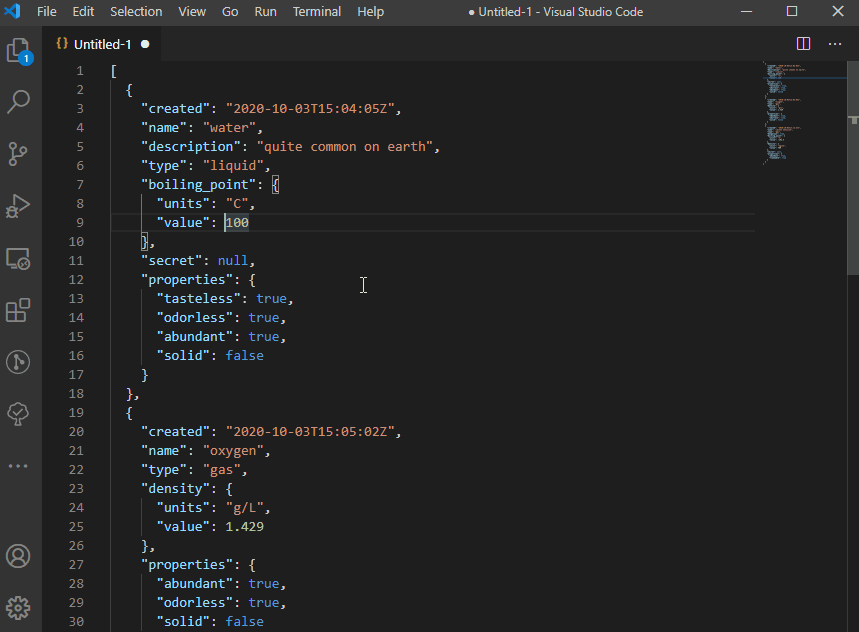

# vsc-json2go

The **vsc-json2go** extension allows you to convert json into go type. You can:

- Convert selected text to go type.
- Convert opened document to go type.

You can find web version here: [https://m-zajac.github.io/json2go/](https://m-zajac.github.io/json2go/).

Original generator code: [https://github.com/m-zajac/json2go](https://github.com/m-zajac/json2go)

## Release Notes

### 1.0.0

Initial release.
